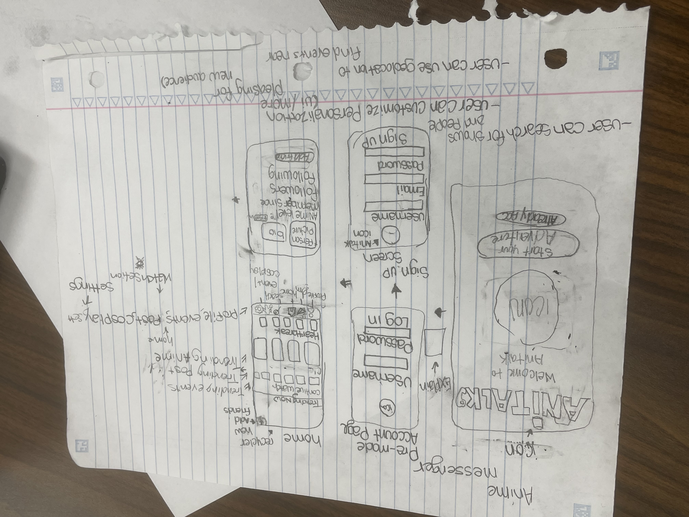

[README (15).md](https://github.com/user-attachments/files/26280675/README.15.md)
# Milestone 1 - AniTalk (Unit 7)

## Table of Contents

1. [Overview](#overview)
2. [Product Spec](#product-spec)
3. [Wireframes](#wireframes)

## Overview

### Description

AniTalk is a mobile anime community app designed for anime fans who want one place to chat, post, explore events, and connect with others who share the same interests. The app combines social messaging, anime discovery, trending discussions, and community interaction into one experience. Users can create an account, personalize a profile, explore anime-related content, and communicate directly with other fans.

### App Evaluation

- **Category:** Social / Entertainment / Messaging
- **Mobile:** The app is built for mobile users to quickly message others, scroll through anime content, post updates, and view events on the go.
- **Story:** Anime fans often use separate apps for chatting, finding anime news, and keeping up with conventions or cosplay events. AniTalk brings those experiences together in one app centered around anime culture.
- **Market:** The target audience includes anime fans, manga readers, cosplayers, and users who enjoy online fan communities.
- **Habit:** Users can return daily to check messages, see new posts, follow trending anime conversations, and browse upcoming events.
- **Scope:** The first version focuses on core social features such as sign up, login, profile creation, messaging, posting, anime discovery, and event browsing. Future versions can include recommendations, group chats, and deeper personalization.

## Product Spec

### 1. User Features (Required and Optional)

**Required Features**

1. User can create an account.
2. User can log in to an existing account.
3. User can view a home page with trending anime and community content.
4. User can create and share posts.
5. User can browse anime-related events and cosplay gatherings.
6. User can access a messaging section to chat with other users.
7. User can view and personalize their profile.
8. User can search for anime, users, or posts.

**Optional Features**

1. User can follow other users.
2. User can like and comment on posts.
3. User can upload cosplay or anime-related photos.
4. User can save favorite anime or events.
5. User can receive anime recommendations.
6. User can customize profile appearance.
7. User can view followers and following lists.

### 2. Screen Archetypes

- **Welcome / Landing Screen**
  - User sees the AniTalk intro screen.
  - User can continue to login or sign up.

- **Login Screen**
  - User enters username and password.
  - User logs into the app.

- **Sign Up Screen**
  - User enters username, email, and password.
  - User creates a new account.

- **Home Screen**
  - User views trending anime, community posts, and recent activity.
  - User can move to messages, profile, search, and events.

- **Messages Screen**
  - User views chats and opens conversations.
  - User sends and receives direct messages.

- **Profile Screen**
  - User views profile picture, bio, anime favorites, followers, and following.
  - User can edit personal profile information.

- **Events Screen**
  - User browses anime conventions, cosplay events, and related meetups.

- **Search Screen**
  - User searches for anime, users, or posts.

### 3. Navigation

**Tab Navigation** (Tab to Screen)

* Home
* Messages
* Search
* Events
* Profile

**Flow Navigation** (Screen to Screen)

- **Welcome / Landing Screen**
  - Login Screen
  - Sign Up Screen

- **Login Screen**
  - Home Screen

- **Sign Up Screen**
  - Home Screen

- **Home Screen**
  - Messages Screen
  - Search Screen
  - Events Screen
  - Profile Screen

- **Messages Screen**
  - Individual Chat Screen

- **Profile Screen**
  - Edit Profile Screen

- **Events Screen**
  - Event Details Screen

- **Search Screen**
  - Anime Details Screen
  - User Profile Screen

## Wireframes

Below is the hand-drawn wireframe for AniTalk:

 
 

### [BONUS] Digital Wireframes & Mockups

To be added in a future milestone.

### [BONUS] Interactive Prototype

To be added in a future milestone.

 

# Milestone 2 - Build Sprint 1 (Unit 8)

## GitHub Project Board

Add a screenshot of your GitHub Project Board here once Sprint 1 planning is complete.

## Issue Cards

- Add a screenshot showing the issues worked on during Sprint 1.
- Add a screenshot showing the issues planned for the next sprint with assigned owners.

## Issues Worked on This Sprint

- Set up the GitHub repository and project board
- Designed the main screen flow for the app
- Built the login and sign-up screens
- Created the basic home screen layout
- Started profile and messaging page designs
- Add a gif showing current build progress for Milestone 2

 

# Milestone 3 - Build Sprint 2 (Unit 9)

## GitHub Project Board

Add an updated screenshot of the GitHub Project Board here for Sprint 2.

## Completed User Stories

- User can create an account
- User can log in
- User can browse the home screen
- User can view profile information
- User can open the messaging section

## Pending / Cut User Stories

- Advanced anime recommendations
- Event booking or RSVP support
- Group chats
- Expanded profile customization

## App Demo Video

- Add the YouTube or Vimeo link for the completed demo video here.
